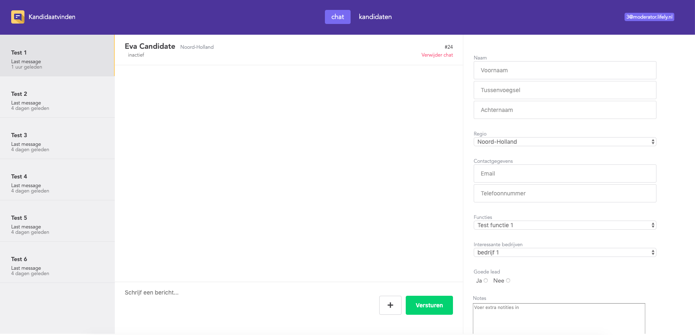
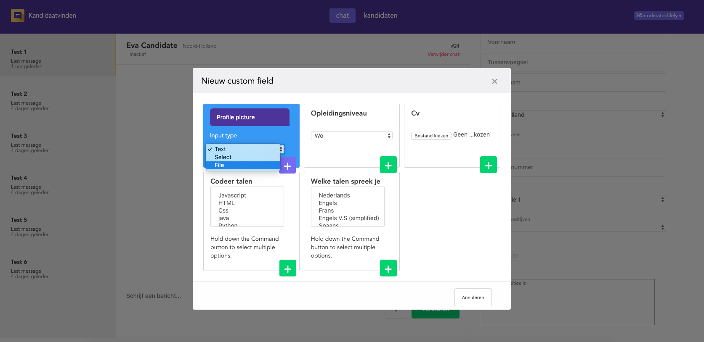
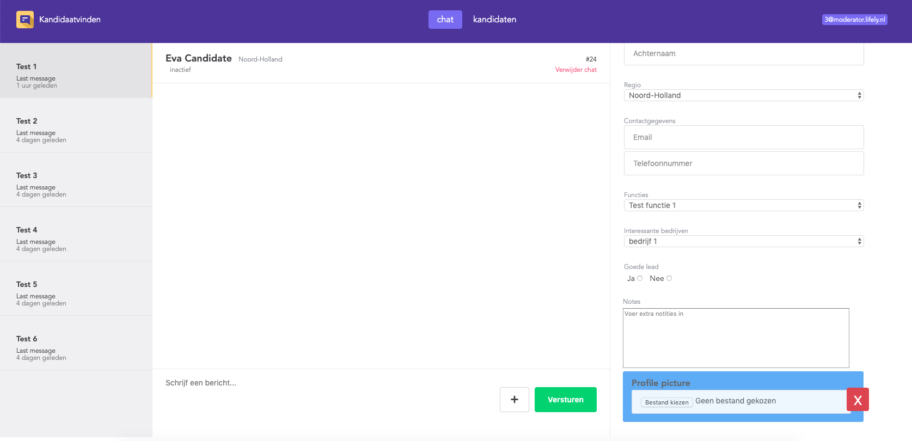
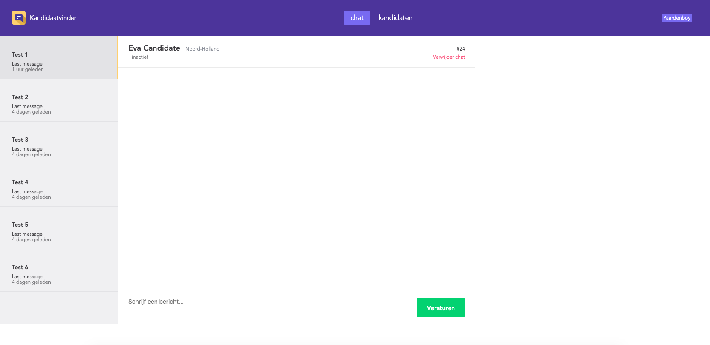

# Project 3 @cmda-minor-web · 2018-2019

  
Admin interface with added function

  
There are three types of inputs you can pick from:
  -file  
  -text  
  -select  

    
  The custom input is added to the form!!!!

  
The interface for the candidate side (looks exactly the same I'm not changing anything here)

### wishlist
From the feedback we received I gathered that the user should also have insights in what is filled in the form. Currently only the admin/moderator has influence and can see the form, but I think there is a lot of room for improvement there.  
I know that it removes form the human-to-human concept by removing the middle-man, but i think it would be interesting at least.  

## Design for kandidaatvinden
I found that the chat worked well but missed the function to add extra/ more specific fields that were applicable for specific functions and job types. The form works like a CV but missed a few fields so I added the function to make your own field.

## added feature
The moderator has the ability to add custom fields when perceived necessary.
This allows the user to fill in/ give more specific information about the client that companies might be interested in.
